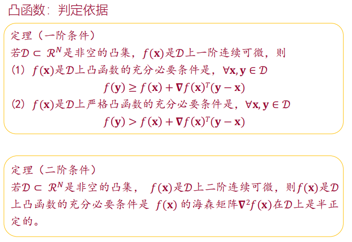
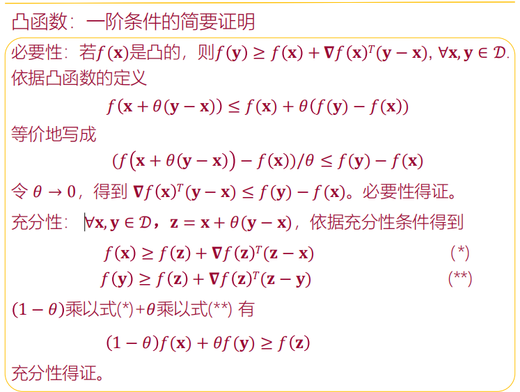
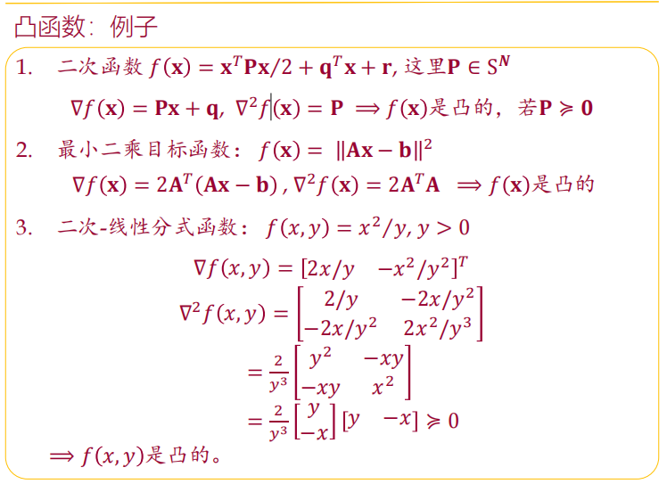

# 最优化理论复习
## 课程总结
- 讨论了一类容易的优化问题：凸优化问题
- 分析问题：
  - 哪些是凸优化问题？  **凸集、凸函数**
  - 凸优化问题有哪些性质？ **对偶理论**
- 讨论几种简单的优化算法： 无约束优化、有约束优化

### 凸集
- **定义：**集合内任意点的**凸组合**仍然在集合内
- 保持集合凸性的操作
  - 交集
  - 仿射函数
  - 透视函数
  - 线性分数函数（放射+透视）
  
### 凸函数
- **定义：**凸组合的函数值小于等于函数值的凸组合
  - 高维情况下的等价定义
  - 一阶可微情况下的等价定义
  - 二阶可微情况下的等价定义

  - **注意：**凸函数的域一定要为凸集！
- 保持函数凸性的操作
  - 非负加权和、仿射映射、极大值函数
  - 函数的组合
  - 函数的透视

### 凸集遇上凸函数
- 凸函数的次水平集必然是凸集
  - 次水平集为凸集的函数是拟凸函数
- 凸优化问题
  - 目标函数为凸函数，可行解集为凸集的极小化问题
  - 目标函数为凸函数，不等式的约束函数为凸函数，等式约束函数的仿射函数的极小化问题
  - **基本概念：**域、可行解集、最优解集、等等
- 典型问题
  - 线性规划、二次规划、二次约束、二次规划

### 对偶
- **拉格朗日函数、对偶函数、对偶问题**
- 对偶问题间隙何时为零（强对偶何时成立）
- 当拉格朗日函数存在鞍点时，强对偶成立，且鞍点时对偶最优解
- **KKT条件（五条）** https://zhuanlan.zhihu.com/p/38163970
https://www.bilibili.com/video/BV1eL4y1n7sX/?spm_id_from=333.788.recommend_more_video.0&vd_source=9fa123b0bae57429fb79ba880f4ac69a

### 优化算法
- 新解＝旧解+步长*方向
  - 步长选择策略：固定步长、递减步长、Armijo Rule、等等
- 无约束优化（求解KKT条件）
  - **一阶方法（梯度、次梯度、邻近点梯度、随机梯度）**
  - 二阶方法（牛顿、拟牛顿）
- 有约束优化（求解KKT条件）
  - 约束满足的牛顿法
  - 原对偶方法：（增广）拉格朗日法、交叉方向乘子法
