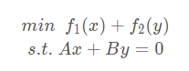
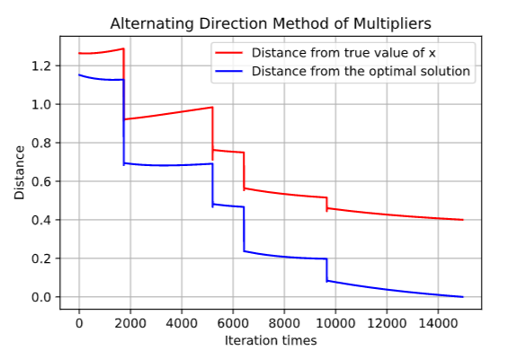

# 最优化理论大作业---作业1
**学号：19335182**

**姓名：唐晨轩**

## 作业要求


## 生成数据
按照题目要求生成数据并保存，以便每个算法用的数据都是相同的。

要求： Ai为 10ⅹ300 维的测量矩阵，x 为 300 维的未知稀疏向量且稀疏度为 5，ei为 10 维的测
量噪声。设 x 的真值中的非零元素服从均值为 0 方差为 1 的高斯分布，Ai中的元素服从均
值为 0 方差为 1 的高斯分布，ei中的元素服从均值为 0 方差为 0.2 的高斯分布。

相关代码如下：
```python
import numpy as np
import random
import matplotlib.pyplot as plt

ASize = (10, 300)
XSize = 300
# A 为 10ⅹ300 维的测量矩阵，A 中的元素服从均值为 0 方差为 1 的高斯分布。
A = np.random.normal(0, 1, ASize)
# x 为 300 维的未知稀疏向量且稀疏度为 5
X = np.zeros(XSize)
# e 为 10 维的测量噪声，e 中的元素服从均值为 0 方差为 0.2 的高斯分布。
e = np.random.normal(0, 0.2, 10)
XIndex = random.sample(list(range(XSize)), 5)  # 5 稀疏度
for xi in XIndex:
    X[xi] = np.random.randn()

b = np.dot(A, X) + e

np.save("A.npy", A)
np.save("X.npy", X)
np.save("b.npy", b)
```

## 算法设计
### 一：邻近点梯度法
根据邻近点梯度法，若函数有结构非光滑，设:


其中s(x)是光滑部分，可微易求导，在本题中s(x)对应的是 1/2||Ax-b||<sub>2</sub><sup>2</sup>
r(x)是非光滑部分，不可微，但可求得邻近点投影


因此有：


在光滑的部分直接求导，非光滑部分求次梯度。若能找到次梯度为0的点，则该点为最优解。
将原问题代入方程，可得到：


而求解argmin的方法可以用软门限法。

因为在计算中无法准确找到次梯度为 0 的点，我们近似地两步之间的二范数 < 10<sup>-5</sup>的点。

相关代码如下：
```python

A = np.load('A.npy')
b = np.load('b.npy')
X = np.load('X.npy')

alpha = 0.001
P_half = 0.01
Xk = np.zeros(XSize)
zero = np.zeros(XSize)
while True:
    Xk_half = Xk - alpha * np.dot(A.T, np.dot(A, Xk) - b)
    # 软门限算子
    Xk_new = zero.copy()
    for i in range(XSize):
        if Xk_half[i] < - alpha * P_half:
            Xk_new[i] = Xk_half[i] + alpha * P_half
        elif Xk_half[i] > alpha * P_half:
            Xk_new[i] = Xk_half[i] - alpha * P_half
    if np.linalg.norm(Xk_new - Xk, ord=2) < 1e-5:
        break
    else:
        Xk = Xk_new.copy()

print(Xk)
print(X)

```


### 二：交替方向乘子法
根据交替方向乘子法有:


其增广拉格朗日函数为：


其中 c 是一个大于 0 的常数。
更新 x<sup>k+1</sup> 和 y<sup>k+1</sup>：


固定 y<sup>k</sup> 和 λ<sup>k</sup>，则有


对于原问题，为了使用交替方向乘子法，引入一个新变量 y = x ，所以一致性约束为 x − y = 0 。
原问题转换为：


对应的，f<sub>1</sub> = 1/2||Ax-b||<sub>2</sub><sup>2</sup>, f<sub>2</sub> = p||y||<sub>1</sub>
将原问题代入该算法的方程，则有


因为 x 部分是光滑的，可求导。所以可以得到 x 的梯度


其中 I 是单位矩阵。
y部分可以求其邻近点投影，这里可以用软门限法来求解。


相关代码如下：
```python

A = np.load('A.npy')
b = np.load('b.npy')
X = np.load('X.npy')

P_half = 0.01
c = 0.005
Xk = np.zeros(XSize)
Zk = np.zeros(XSize)
Vk = np.zeros(XSize)

X_opt_dst_steps = []
X_dst_steps = []

while True:
    Xk_new = np.dot(
        np.linalg.inv(np.dot(A.T, A) + c * np.eye(XSize, XSize)),
        c*Zk + Vk + np.dot(A.T, b)
    )

    # 软门限算子
    Zk_new = np.zeros(XSize)
    for i in range(XSize):
        if Xk_new[i] - Vk[i] / c < - P_half / c:
            Zk_new[i] = Xk_new[i] - Vk[i] / c + P_half / c
        elif Xk_new[i] - Vk[i] / c > P_half / c:
            Zk_new[i] = Xk_new[i] - Vk[i] / c - P_half / c

    Vk_new = Vk + c * (Zk_new - Xk_new)

    # print(np.linalg.norm(Xk_new - Xk, ord=2))

    X_dst_steps.append(np.linalg.norm(Xk_new - X, ord=2))
    X_opt_dst_steps.append(Xk_new)
    if np.linalg.norm(Xk_new - Xk, ord=2) < 1e-5:
        break
    else:
        Xk = Xk_new.copy()
        Zk = Zk_new.copy()
        Vk = Vk_new.copy()

print(Xk)
print(X)

X_opt = X_opt_dst_steps[-1]

for i, data in enumerate(X_opt_dst_steps):
    X_opt_dst_steps[i] = np.linalg.norm(data - X_opt, ord=2)
plt.title("Distance")
plt.plot(X_opt_dst_steps, label='X-opt-distance')
plt.plot(X_dst_steps, label='X-real-distance')
plt.legend()
plt.show()

```


### 三：次梯度法
根据次梯度法，有


其中 g<sub>0</sub> 是 f<sub>0</sub> 的次梯度，满足 g<sub>0</sub> ∈ ∂f<sub>0</sub>
次梯度可以由软门限算法求得。
次梯度法的步长选取有几种方法，如固定步长，不可加但平方可加的变长步长，不可加且平方不可加的变长步长。这里我选择的是变长步长 α<sup>k</sup> = 0.001/k 。

相关代码如下：
```python

A = np.load('A.npy')
b = np.load('b.npy')
X = np.load('X.npy')


def g_right(x):
    Xnew = x.copy()
    for i, data in enumerate(x):
        if data == 0:
            Xnew[i] = 2 * np.random.random() - 1
        else:
            Xnew[i] = np.sign(x[i])
    return Xnew


alpha = 0.001
p_half = 0.001
alphak = alpha
i = 0

g = lambda x: 2 * np.dot(A.T, (np.dot(A, x) - b)) + p_half * g_right(x)
Xk = np.zeros(XSize)
X_opt_dst_steps = []
X_dst_steps = []

while True:
    Xk_new = Xk - alphak * g(Xk)
    alphak = alpha / (i + 1)
    i += 1
    X_dst_steps.append(np.linalg.norm(Xk_new - X, ord=2))
    X_opt_dst_steps.append(Xk_new)
    print(np.linalg.norm(Xk_new - Xk, ord=2))
    if np.linalg.norm(Xk_new - Xk, ord=2) < 1e-5:
        break
    else:
        Xk = Xk_new.copy()

print(Xk)
print(X)

X_opt = X_opt_dst_steps[-1]

for i, data in enumerate(X_opt_dst_steps):
    X_opt_dst_steps[i] = np.linalg.norm(data - X_opt, ord=2)
plt.title("Distance")
plt.plot(X_opt_dst_steps, label='X-opt-distance')
plt.plot(X_dst_steps, label='X-real-distance')
plt.legend()
plt.show()

```


## 结果展示

注意：由于数据是随机生成的，因此以下结果并不是固定的。

邻近点梯度下降法：

| 正则化参数p | 图像     | 
| ------ | -------- | 
| 0.01   |      | 
| 0.1    |           | 
|  1     |          | 
|  10     |          | 

可见正则化参数 p 的大小影响最优解的稀疏度，p 越大，最优解越稀疏；随着 p 的增大，收敛的迭代次数变少。

交替方向乘子法：

| 正则化参数p | 图像     | 
| ------ | -------- | 
| 0.01   |      | 
| 0.1    |           | 
|  1     |          | 
|  10     |          | 

可见正则化参数 p 的大小对最优解的稀疏度没有什么影响；随着 p 的增大，收敛的迭代次数变多。

次梯度法：

| 正则化参数p | 图像     | 
| ------ | -------- | 
| 0.01   |      | 
| 0.1    |           | 
|  1     |          | 
|  10     |          | 

在次梯度法中，对结果的影响似乎并不明显。
将次梯度法的图像与邻近点梯度法、交替方向乘子法相比较，可以看出次梯度法的回归效果并不是很理想，尽管最优解能够收敛，然而最优解与真值的差距较大。

L1 正则化的作用：

通过查阅资料以及简单的数学分析，发现 L1 正则化可以起到使参数更加系稀疏的作用。
当正则化惩罚项 p||x||<sub>1</sub> 被加入到目标函数中后，要极小化原目标函数与惩罚项之和，会受到该惩罚项的约束。
当 p||x||<sub>1</sub> 较大时，为了使目标函数尽可能小，需要使惩罚项尽可能小，而 ||x||<sub>1</sub> = Σ<sub>i</sub>|x|<sub>i</sub> ，所以 x 越稀疏，惩罚项的值就可以越小。
