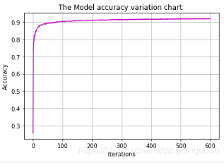
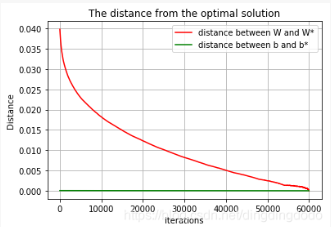

# 最优化理论大作业---作业2
**学号：19335182**

**姓名：唐晨轩**

## 作业要求


## 载入 MNIST 数据集
这里没有什么要解释的地方，就略过了。

相关代码如下：
```python
# -*- coding: utf-8 -*-
"""
Created on Mon Dec 16 10:22:12 2019
@author: Ding
"""
import numpy as np
import matplotlib.pyplot as plt
import gzip as gz
#--------------------读取数据----------
#filename为文件名，kind为'data'或'lable'
def load_data(filename,kind):
    with gz.open(filename, 'rb') as fo:
        buf = fo.read()
        index=0
        if kind=='data':
        #因为数据结构中前4行的数据类型都是32位整型，所以采用i格式，需要读取前4行数据，所以需要4个i
            header = np.frombuffer(buf, '>i', 4, index)
            index += header.size * header.itemsize
            data = np.frombuffer(buf, '>B', header[1] * header[2] * header[3], index).reshape(header[1], -1)
        elif kind=='lable':
        #因为数据结构中前2行的数据类型都是32位整型，所以采用i格式，需要读取前2行数据，所以需要2个i
            header=np.frombuffer(buf,'>i',2,0)
            index+=header.size*header.itemsize
            data = np.frombuffer(buf, '>B', header[1], index)
    return data
#--------------------加载数据-------------------                
X_train = load_data('train-images-idx3-ubyte.gz','data')  # 训练数据集的样本特征
y_train = load_data('train-labels-idx1-ubyte.gz','lable')  # 训练数据集的标签
X_test = load_data('t10k-images-idx3-ubyte.gz','data')  # 测试数据集的样本特征
y_test = load_data('t10k-labels-idx1-ubyte.gz','lable')  # 测试数据集的标签
#---------查看数据的格式-------------
print('Train data shape:')
print(X_train.shape, y_train.shape)
print('Test data shape:')
print(X_test.shape, y_test.shape)
#--------------查看几个数据-----------
index_1 = 1024
plt.imshow(np.reshape(X_train[index_1], (28, 28)), cmap='gray')
plt.title('Index:{}'.format(index_1))
plt.show()
print('Label: {}'.format(y_train[index_1]))

index_2=2048
plt.imshow(np.reshape(X_train[index_2], (28, 28)), cmap='gray')
plt.title('Index:{}'.format(index_2))
plt.show()
print('Label: {}'.format(y_train[index_2]))

```

读取数据后存储在x_train,y_train,x_test,y_test中，查看了其中的两个数据，看一下数据的情况：


可以看出train数据中有60000个，test数据中有10000，data中数据为手写数字图像，在示例中我们可以看到图像还是较易识别的。

## 建立模型
该问题是一个多分类问题，因此使用Logistic Regression时激活函数选用Softmax函数:


该函数可以将输入映射为0 − 1 0-10−1之间的实数，同时具有归一化的特征，因此与概率可以对应，易与分类任务对应。


故根据这个思路，建立Logistic Regression模型。

## 定义损失函数
在使用softmax函数时，我们普遍采用交叉熵作为损失函数：


其中 p 表示期望的概率分布，q 表示实际的概率分布，L 表示交叉熵。

交叉熵刻画的是实际输出概率和期望输出概率的距离，交叉熵的值越小，则两个概率分布越接近，即实际与期望差距越小 。交叉熵可以反映出隐藏在输出结果背后的更深的错误率表现出来。

因此，在softmax模型中，用交叉熵函数表示的损失函数为：


其中 y<sub>i</sub> 表示样本标签，表示是否属于类型 c , p<sub>i</sub> 为属于类型c的概率
由于我们使用了softmax函数的输出作为概率，故在此处 p<sub>i</sub> 可以视为 softmax(y<sub>i</sub>)
进一步简化，每一次的标签实际上除了真实值处，其余均为0，故对于单数据而言：


实际上我们是希望通过训练得到一个 y=Wx+by ，再对该函数的结果进行softmax，使该线性函数能够将x映射到正确的标签，所以训练目标为找到最优的W和b
故对于样本( x<sub>i</sub> , y<sub>i</sub> ) ,损失函数为


单样本损失函数梯度如下：


在此多样本情况直接相加即可。
需要注意的是，我们最终的预测结果为softmax函数的结果向量中最大的元素的下标。
同时，我们可以通过将训练后的模型进行测验，从而在测试集上得到正确率accurate_rate，以检验模型效果，通过调整参数等操作使正确率尽可以高。

相关代码如下：
```python
#-------------------------------定义常量-----------------
x_dim = 28 * 28  #data shape,28*28
y_dim = 10       #output shape,10*1
W_dim = (y_dim, x_dim)  # 矩阵W
b_dim = y_dim     #index b
#----------------------定义logic regression中的必要函数------
# Softmax函数
def softmax(x):
    """
    输入向量x,输出其经softmax变换后的向量
    """
    return np.exp(x) / np.exp(x).sum()

#Loss函数
#L=-log(Si(yi)),yi为预测值
def loss(W, b, x, y):
    """
    W, b为当前的权重和偏置参数，x,y为样本数据和该样本对应的标签
    """
    return -np.log(softmax(np.dot(W,x) + b)[y])  # 预测值与标签相同的概率

#单样本损失函数梯度
#按照公式很容易写出来
def L_Gra(W, b, x, y):
    """
     W, b为当前的权重和偏置参数，x,y为样本数据和该样本对应的标签
    """
    #初始化
    W_G = np.zeros(W.shape)
    b_G = np.zeros(b.shape)
    S = softmax(np.dot(W,x) + b)
    W_row=W.shape[0]
    W_column=W.shape[1]
    b_column=b.shape[0]
    #对Wij和bi分别求梯度
    for i in range(W_row):
        for j in range(W_column):
            W_G[i][j]=(S[i] - 1) * x[j] if y==i else S[i]*x[j]
               
    for i in range(b_column):
        b_G[i]=S[i]-1 if y==i else S[i]
    #返回W和b的梯度    
    return W_G, b_G

#检验模型在测试集上的正确率
def test_accurate(W, b, X_test, y_test):
    num = len(X_test)
    #results中保存测试结果，正确则添加一个1，错误则添加一个0
    results = []             
    for i in range(num):
        #检验softmax(W*x+b)中最大的元素的下标是否为y，若是则预测正确
        y_i = np.dot(W,X_test[i])+ b
        res=1 if softmax(y_i).argmax()==y_test[i] else 0
        results.append(res)
        
    accurate_rate=np.mean(results)
    return accurate_rate

```

## 梯度下降法
建立好Logistic Regression模型后，可以对该模型进行优化，以得到较好的参数。

在此仅设置一个mini_batch算法，因为在mini_batch算法中，当size为1时则为随机梯度下降，当size为all时则为梯度下降，因此可以通过调整size的大小实现不同的梯度下降策略。

### 批量梯度下降、随机梯度下降、mini-batch梯度下降算法简介：
- 批量梯度下降每次迭代时使用所有样本进行梯度的更新，每次更新的梯度就是所有的梯度和，故当目标函数为凸函数时，一定可以达到全局最优，但是由于每次需要使用所有样本，因此训练过程非常慢，并且当样本非常大时将耗费巨大的计算资源和时间
- 随机梯度下降每次迭代随机使用一个样本，因此每轮迭代将非常快，但是由于单个样本不能代表全局样本的趋势，故可能无法收敛，同时使最优解的准确度下降，但由于其速度上有非常好的优势，故现在大多数样本较大的机器学习采用该策略。随机梯度下降通常来说使得参数在大体上趋向于最优的，通常会达到最优解附近
- mini-batch梯度下降则是上述两种方法的折中，每次迭代采用batch-size个样本数据来对参数进行更新，故在该方法中size的选择通常是较为重要的，选择较好的size可以发挥批量梯度下降和随机梯度下降的优势，在较快的速度内完成迭代且最终有着不错的收敛效果。实际上当size选择为1的时候就是随机梯度下降，当size为data-size的时候则为批量梯度下降
- 需要注意的是，通过查看训练数据可以得知数据具有非常好的随机性，即不具备局部性的特点(并非是一批数据为1的数据聚集在一起，一批数据为2的样本聚集在一起，而是非常好的分散随机分布)，故在此可以直接遍历每一个batch数据即可，不需要每次选取随机以避免局部性的特点

设置不同的size时对应的梯度只需要将所取的样本求和即可。

故写代码时直接写一个具有泛化的mini-batch，通过修改步长即可完成三种方法的实现和比较。

相关代码如下：
```python
# mini-batch随机梯度下降
def mini_batch(batch_size,alpha,epoches):
    """ 
    batch_size为batch的尺寸，alpha为步长,epochsnum为epoch的数量，即直接决定了训练的次数
    """
    accurate_rates = []  # 记录每次迭代的正确率 accurate_rate
    iters_W = []  # 记录每次迭代的 W
    iters_b = []  # 记录每次迭代的 b
    
    W = np.zeros(W_dim)  
    b = np.zeros(b_dim) 
    #根据batch_size的尺寸将原样本和标签分批后
    #初始化
    x_batches=np.zeros(((int(X_train.shape[0]/batch_size),batch_size, 784)))
    y_batches=np.zeros(((int(X_train.shape[0]/batch_size),batch_size)))
    batches_num = int(X_train.shape[0]/batch_size)
    #分批
    for i in range(0,X_train.shape[0],batch_size):
        x_batches[int(i/batch_size)]=X_train[i:i+batch_size]
        y_batches[int(i/batch_size)]=y_train[i:i+batch_size]
    print('Start training...')

    start = time.time()  # 开始计时
	#print(start)
    for epoch in range(epoches): #对所有样本循环一遍为一个epoch
        for i in range(batches_num): #对一个batch循环一遍为一个iteration
            #初始化梯度
            W_gradients = np.zeros(W_dim)
            b_gradients = np.zeros(b_dim)
            
            x_batch,y_batch= x_batches[i],y_batches[i]
            
            #求一个batch的梯度，实际上对一个batch中的样本梯度求和然后平均即可
            for j in range(batch_size):
                W_g,b_g = L_Gra(W, b,x_batch[j], y_batch[j])
                W_gradients += W_g
                b_gradients += b_g
            W_gradients /= batch_size  
            b_gradients /= batch_size
            #进行梯度下降
            W -= alpha * W_gradients
            b -= alpha * b_gradients
            #把迭代后的精度、W、b都加入到相应的数组，便于之后分析和绘制图像
            #当size较小时采用每100个ite记录一次
            #当size较大时每次ite记录一次
            if i%100==0:
                accurate_rates.append(test_accurate(W, b, X_test, y_test))
            #accurate_rates.append(test_accurate(W, b, X_test, y_test))
            iters_W.append(W.copy())
            iters_b.append(b.copy())
            
    end = time.time()  # 结束计时
    #print(end)
    time_cost=(end - start)
    
    return W,b,time_cost, accurate_rates, iters_W, iters_b

```

### 模型整合
优化方法完成后，便可以对整个Logistic Regression模型进行整合，对输入的参数进行调试并以可视化的方式查看效果，包括随着迭代的进行模型在测试集上的精度变化图、W和b的收敛效果图(即每次迭代时每步计算结果与最优解的距离)：

相关代码如下：
```python
#-------------模型的主函数-------------------
def run(alpha,batch_size,epochs_num):
    #将参数带入并训练，将训练结果存储到下列变量中
    #W和b表示最优的W和b,time_cost表示训练该模型时间
    #accuracys,W_s,b_s分别表示accuracy,W,b随着迭代次数的变化的变化
    W,b,time_cost,accuracys,W_s,b_s = mini_batch(batch_size,alpha,epochs_num)
    
    #求W和b与最优解的距离，用二阶范数表示距离
    iterations=len(W_s)
    dis_W=[]
    dis_b=[]
    
    #test=b_s[:10]
    #print(test)
    #起初b的变化是直线，仔细分析数据后发现b值确实为非常小的值，图像中难以显示
    
    for i in range(iterations):   
        dis_W.append(np.linalg.norm(W_s[i] - W))
        dis_b.append(np.linalg.norm(b_s[i] - b))

    #--------简单介绍------
    print("the parameters is: step length alpah:{}; batch size:{}; Epoches:{}".format(alpha, batch_size, epochs_num))
    print("Result: accuracy:{:.2%},time cost:{:.2f}".format(accuracys[-1],time_cost))
        
    #----------------作图--------------
    #精确度随迭代次数的变化
    plt.title('The Model accuracy variation chart ')
    plt.xlabel('Iterations')
    plt.ylabel('Accuracy')
    plt.plot(accuracys,'m')
    plt.grid()
    plt.show()
    #W和b距最优解的距离随迭代次数的变化
    plt.title('The distance from the optimal solution')
    plt.xlabel('Iterations')
    plt.ylabel('Distance')
    plt.plot(dis_W,'r', label='distance between W and W*')
    plt.plot(dis_b,'g',label='distance between b and b*')
    plt.legend()
    plt.grid()
    plt.show()
    
    #print(W,b)
    
#----------参数输入---------------
alpha = 1e-5
batch_size = 1000
epochs_num = 1
# 运行函数
run(alpha,batch_size,epochs_num)

```

至此，整个模型完成，可以输入不同参数进行调整。

## 结果分析
调整不同的batch-size和步长 α 以及epoch(每个样本的使用次数)，查看精度以及训练时间、迭代次数等情况：
- 步长 α
batch-size为1000,epoch=1时的不同 α 的效果

| 步长α | 训练效果     | 精度   |
| ------ | -------- | -------- | 
| 10<sup>-5</sup>   |      |  89.54%  | 
| 10<sup>-4</sup>    |           |   89.74%  | 
|  10<sup>-3</sup>     |          |   9.9%  | 

故之后均选取了 α = 10<sup>-5</sup> 或 10<sup>-4</sup> 作为步长

- batch-size

当 batch-size=60000 时，此时等价于**全批量梯度下降**：

| 步长α | epochs   |  成功率  |  与最优解距离  | 成功率   |
| ------ | -------- | -------- | -------- | -------- |
| 10<sup>-5</sup>   |    100   |   |       |   90.4% | 
| 10<sup>-4</sup>    |   100   |    |       |  86.31%   | 
|  10<sup>-5</sup>     |  1000   |    |       |  92.15%   | 
|  10<sup>-4</sup>     |   1000  |     |       |   92.11%  | 

当 batch-size=2000 时，实验结果如下：

| 步长α | epochs   |  成功率  |  与最优解距离  | 成功率   |
| ------ | -------- | -------- | -------- | -------- |
| 10<sup>-5</sup>   |    10   |   |       |   91.40%| 
| 10<sup>-5</sup>    |   100   |    |       |  92.38%   | 


当 batch-size=100 时，结果如下：(由于batch-size比较小，迭代太多，故每100次迭代计算一次accuracy)

| 步长α | epochs   |  成功率  |  与最优解距离  | 成功率   |
| ------ | -------- | -------- | -------- | -------- |
| 10<sup>-5</sup>   |    10   |   |       |   91.78% | 
| 10<sup>-6</sup>    |   10   |    |       |  91.94%   | 


当 batch-size=10 时，结果如下：(由于batch-size比较小，迭代太多，故每100次迭代计算一次accuracy)

| 步长α | epochs   |  成功率  |  与最优解距离  | 成功率   |
| ------ | -------- | -------- | -------- | -------- |
| 10<sup>-6</sup>   |    1   |   |       |   90.58% | 
| 10<sup>-7</sup>    |   10   |    |       |  91.92%   | 
 

当 batch-size=1 时，等价于**随机梯度下降**，结果如下：(由于batch-size比较小，迭代太多，故每100次迭代计算一次accuracy)

| 步长α | epochs   |  成功率  |  与最优解距离  | 成功率   |
| ------ | -------- | -------- | -------- | -------- |
| 10<sup>-7</sup>   |    1   |   |       |   90.4% | 


### 总结结果分析
对比上述结果，当batch-size选取为2000和100以及10时均可以在可接受训练时间内达到一个很不错的效果，92% 左右，效果非常理想。通常来说，会通过结果来测试不同size的影响，在时间和效果上取折中方案，随机梯度下降非常快但是总体效果并不是最好，因为会在最优解附近波动，通过适当加大size可以在较短时间内获得较为稳定的最优解。